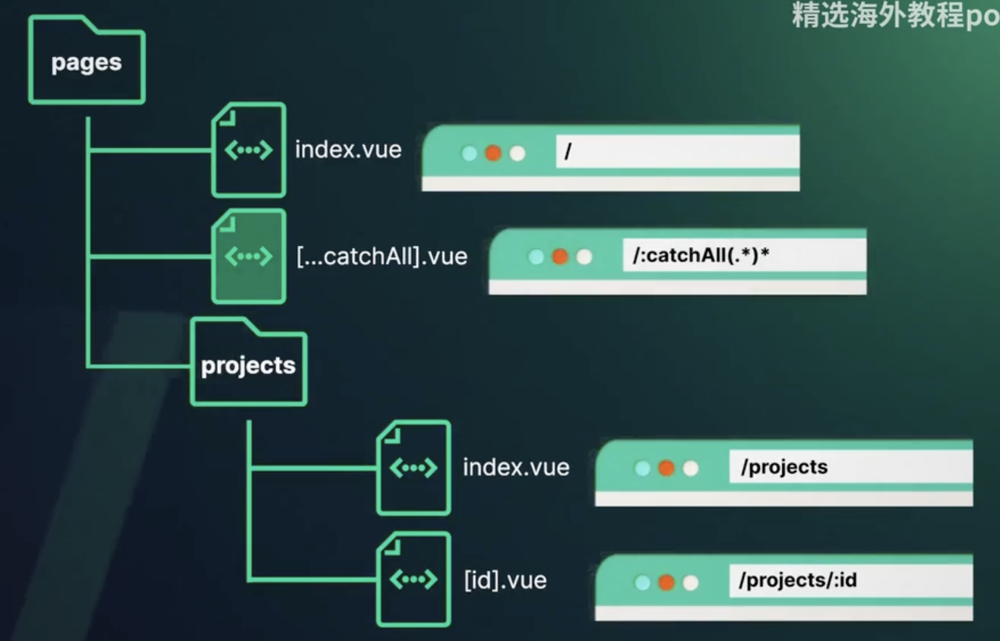

# Auto routes

```sh
npm i -D unplugin-vue-router
```

modify vite.config.ts

```js
import VueRouter form 'unplugin-vue-router/vite'

```

Modify the router/index.ts

rename the folder to pages

add "typed-touter.d.ts" to tsconfig.app.json

add reference to `env.d.ts` to tell IDE about global types
```
/// <reference types="unplugin-vue-router/client" />
``` 




Fix the ESlint warning
```js
{
    rules: {
        'vue/multi-word-component-names': ['off']
    }
}
```