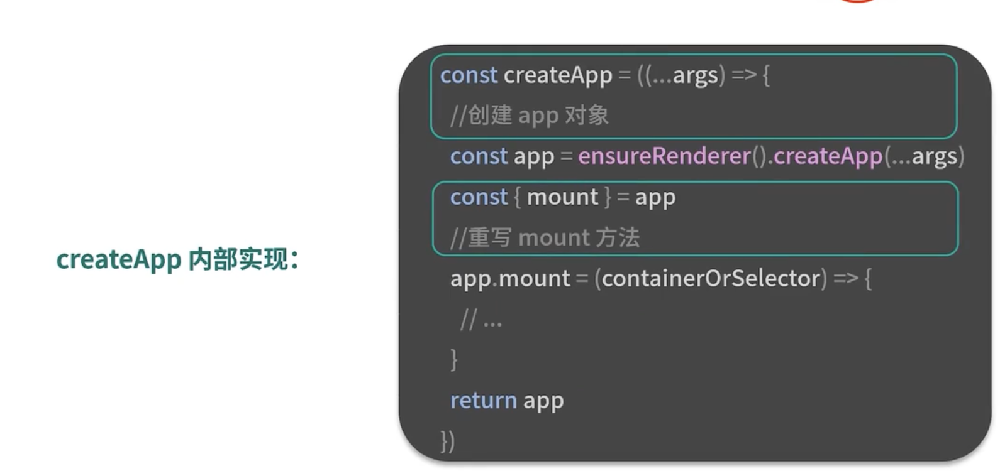
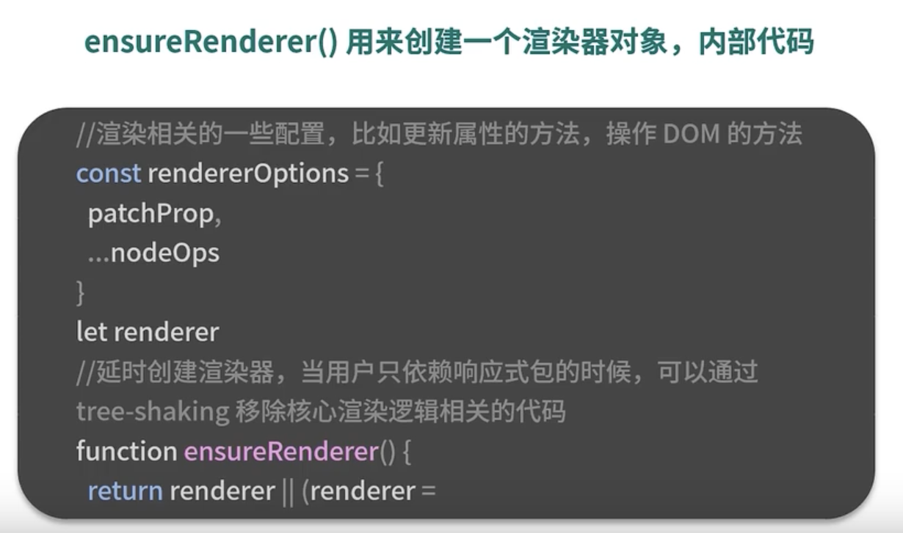

# 组件渲染：vnode 到真实 DOM 是如何转变的？

create vnode -> render vnode -> create DOM

vnode is a JavaScript object describing a real DOM or a component

vue app init: mound App component to a div DOM
  

createApp
  

render is a Javascript object contains rendering logic
  

  

